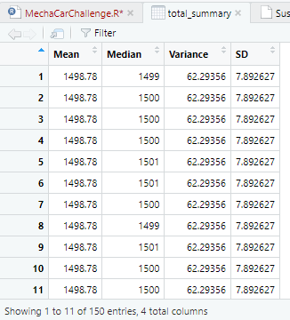
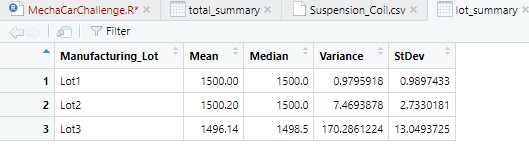
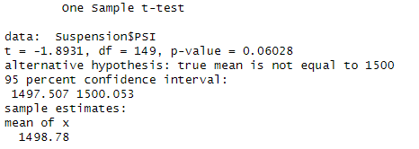
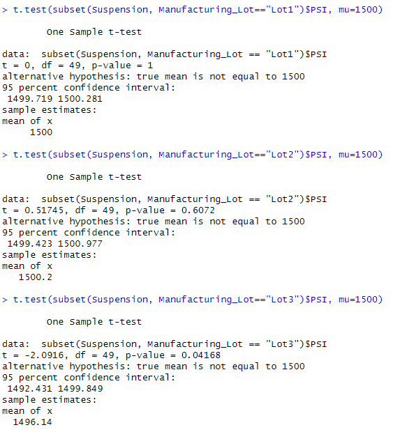

# MechaCar_Statistical_Analysis

## Linear Regression to Predict MPG

- Which variables/coefficients provided a non-random amount of variance to the mpg values in the dataset?
Vehicle Length provides the strongest non-random variance with a p-value of 2.60e-12. This is followed by Ground Clearance with a p-value of 5.21e-8.

- Is the slope of the linear model considered to be zero? Why or why not?
The slope of the linear model is not zero. This is observed by the slope coefficients which contain non-zero values(vehicle length, ground clearance, and AWD), and the p-value which is 5.35e-11 is less than the significance level of p=0.05.

- Does this linear model predict mpg of MechaCar prototypes effectively? Why or why not?
The linear model has an r-squared value of 0.7149, which means that 71% of all mpg of MechaCar prototypes can be effectively predicted by this model. 

## Summary Statistics on Suspension Coils

- The design specifications for the MechaCar suspension coils dictate that the variance of the suspension coils must not exceed 100 pounds per square inch. Does the current manufacturing data meet this design specification for all manufacturing lots in total and each lot individually? Why or why not?
We observe from the total summary that the variance of lot 1 and lot 2 does fall under the maximum variance of 100 PSI with a variance of 62 PSI. However, Lot 3 exceeds the variance with 170.28 PSI. 

## T-Tests on Suspension Coils

