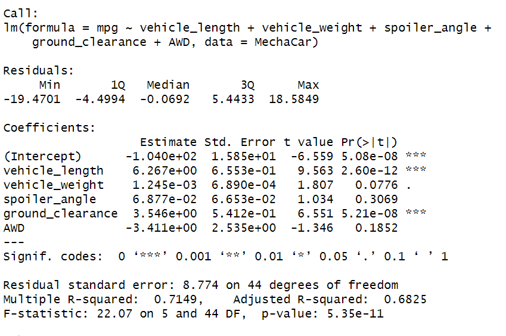

# MechaCar_Statistical_Analysis

## Linear Regression to Predict MPG

- Which variables/coefficients provided a non-random amount of variance to the mpg values in the dataset?

- Is the slope of the linear model considered to be zero? Why or why not?

- Does this linear model predict mpg of MechaCar prototypes effectively? Why or why not?